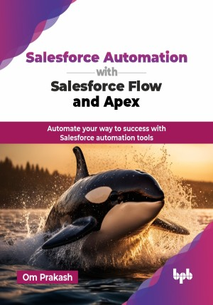

# Salesforce Automation with Salesforce Flow and Apex

Automate your way to success with Salesforce automation tools.

This is the repository for [Salesforce Automation with Salesforce Flow and Apex
](https://bpbonline.com/products/salesforce-automation-with-salesforce-flow-and-apex?variant=44253964599496),published by BPB Publications.

## About the Book
Introducing "Salesforce Automation with Salesforce Flow and Apex", a practical guide designed for anyone wanting to learn Salesforce automation. Whether you are just starting out or looking to build on your existing skills, this book is here to help you navigate the world of Salesforce flow and automation techniques.

This book provides a comprehensive guide to Salesforce flow, a powerful automation tool within the Salesforce platform. It covers foundational concepts like flow types, elements, and debugging techniques. The book explains advanced topics such as screen flows, record-triggered flows, schedule-triggered flows, and platform event-triggered flows. It also explores the integration of flows with Apex to enhance functionality. Additionally, the book covers best practices for performance optimization, error handling, and security. It provides guidance on migrating from traditional automation tools like workflow rule and process builder to flow.

By the end of this book, you will be ready to make a real impact with your Salesforce skills, driving efficiency and innovation in your organization.

## What You Will Learn
• Grasp the importance of Salesforce automation and its transformative impact on business efficiency.

• Explore Salesforce flow features and learn to create, debug, and optimize various flows, including screen and record-triggered flows.

• Create intuitive and reusable user-friendly interfaces using Mendix’s drag-and-drop tools, enhancing user experience.

• To automate business processes with microflows, including complex decision-making and data manipulation.

• Master autolaunched flows, integrate them with Apex, and enhance automation using platform events and scheduled flows.

• Implement secure flow sharing, migrate from legacy automation tools, and integrate flows with external systems for seamless data exchange.

• Combine flows and Apex triggers to build advanced, real-time automation solutions tailored to business needs.

